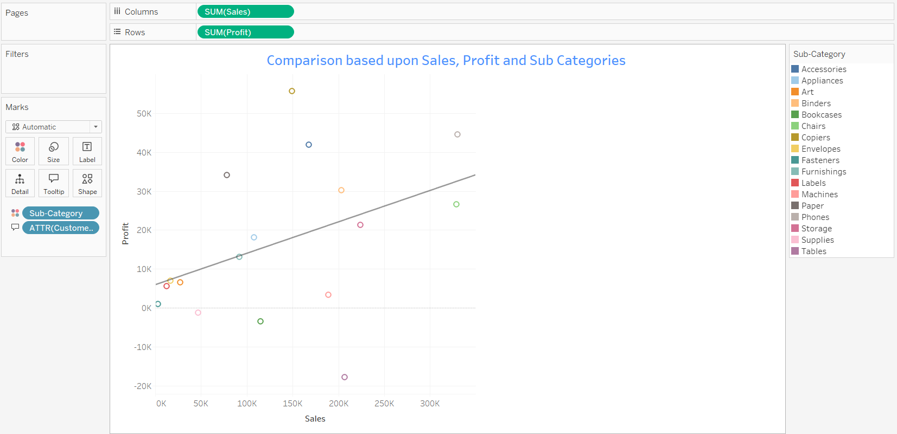

# DASHBOARD-DEVELOPMENT

# CODTECH Internship - Data Analysis Tasks

*COMPANY*: CODTECH IT SOLUTIONS

*NAME*: ANUBHAV SINGH

*INTERN ID*: CT06DA708

*DOMAIN*: DATA ANALYTICS

*DURATION*: 6 WEEEKS

*MENTOR*: NEELA SANTOSH

# CODTECH Internship - Data Analysis Tasks

## Task 3: Interactive Sales Dashboard Development with Tableau

### Overview

This project focuses on creating an interactive dashboard using Tableau to visualize and analyze sales data. The dashboard is designed to provide actionable insights into sales performance across different dimensions such as region, state, product categories, and time, demonstrating data visualization and dashboard development skills.

### Visualizations Included

The dashboard comprises the following interactive visualizations:

**Dashboard**
 

*   **Top 10 State Sales based on Region:** A bar chart showcasing the top 10 states by sales, filtered by region. This allows for quick identification of top-performing states within each region.

    
    

*   **Comparison based upon Sales, Profit and Sub Categories:** A scatter plot comparing Sales and Profit across different Sub-Categories. This visualization helps to understand the relationship between sales and profit for various product sub-categories, and identify outliers.

    
    

*   **Maximum Sales based on Sub categories:** A bar chart displaying the maximum sales for each Sub-Category. This highlights the sub-categories with the highest sales potential.

    
    

*   **Year wise Sales and Profit:** A line chart showing the trend of Sales and Profit over the years. This visualization provides a temporal view of business performance and growth trends.

    
    

*   **Product name & Sub Categories V/s Sales:** A packed bubbles chart visualizing Sales by Product Name and Sub-Category. The size of the bubbles represents the sales volume, and the color represents the Sub-Category, providing a visual hierarchy and category-based comparison.

    
    

*   **Top 15 Product name and their Discount:** A slope chart displaying the top 15 products with their corresponding discounts. This visualization allows for quick identification of products with high discounts and their discount magnitudes.

    
    

### Instructions

The dashboard is interactive. You can explore the data by:

*   **Using Filters:**  Utilize the Region and State filters to focus on specific geographic areas in the "Top 10 State Sales based on Region" and "Comparison based upon Sales, Profit and Sub Categories" visualizations.
*   **Hovering for Details:** Hover over data points in any visualization to see detailed information like exact sales figures, profit values, product names, etc.
*   **Exploring Different Views:** Each sheet within the Tableau workbook presents a unique perspective on the sales data. Navigate between sheets using the tabs at the bottom to explore different aspects of the data.

### Insights

The dashboard provides actionable insights including:

*   **Regional Sales Performance:** Identify top and bottom performing states within each region.
*   **Profitability Analysis:** Understand which product sub-categories are most profitable and which ones are struggling.
*   **Sales Trends Over Time:** Analyze sales and profit growth or decline over the years.
*   **Product Performance:** Discover top-selling products and sub-categories, and identify products with significant discounts.
*   **Discount Impact:** Visualize the discount levels for top products.

### How to Access the Dashboard

1.  **Tableau Public:** The dashboard is hosted on Tableau Public.
2.  **Web Browser:** Access the interactive dashboard through the provided Tableau Public link in any web browser. No Tableau Desktop installation is required to view the dashboard.
